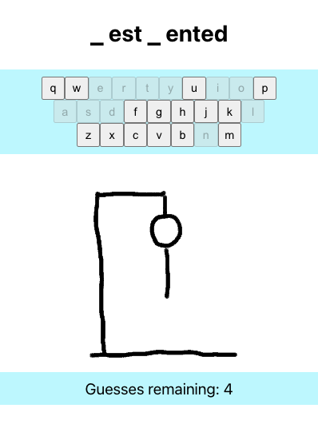
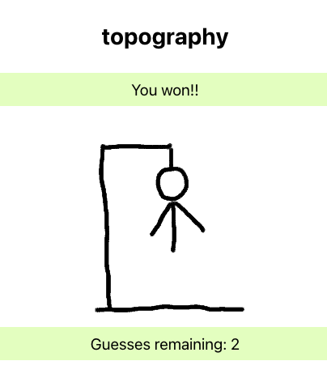
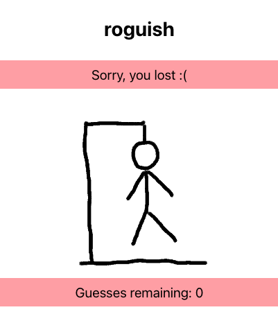

# Hangman Word Game

### Project Description

This is a web app built with Create React App, which lets the user play Hangman in the browser.

### Introduction

Hangman is a classic word game that has been around for generations and never fails to entertain and challenge players of all ages. The game's premise is simple: we are trying to guess a secret word by suggesting letters one at a time. If the guess is correct, the letter is revealed in its proper place in the word. If the guess is incorrect, a part of a stick figure is drawn on the page. The objective is to guess the word before the entire stick figure is drawn, completing the "hanging" of the man. As the stick figure takes shape, the pressure mounts to correctly guess the word before it's too late. Players must choose their letters wisely, considering the frequency of certain letters in the English language and trying to deduce the word based on the revealed letters.

This app contains a dictionary of over 60,000 words, so you will definitely have a vast selection of random starting words, and may even learn a new word!

### Installation

If you are reading this outside of GitHub, please navigate to the project page: 

Click the green "Code" button on the right hand side, and select "download Zip". Unzip the downloaded file to a location of your choice.

Open your terminal or command prompt and navigate to the project directory. Then please run: 'npm install' to recover the node_modules needed for the game to run, then 'npm start' to launch the application.

The app will now run in a new default browser window, or you can navigate to it at [http://localhost:3000](http://localhost:3000).

### Rules

* Take a look at the word represented by the blank spaces
* Start to guess likely letters by clicking on the keyboard
* A wrong guess will progress the drawing of the gallows
* It will also reduce your guesses remaining by 1
* You have a total of 10 'lives' or incorrect guesses
* Once these have run out, it will be 'game over'
* This will also complete the drawing of the man being hanged
* BUT if you complete the word with guesses remaining you WIN!
* A good tip is to guess common letters to begin with, eg vowels
* You may be able to picture the word once it starts to take shape

### Gameplay

This is how the game looks when you are in progress:

This is how the game looks if you win:

This is how the game looks if you lose:

